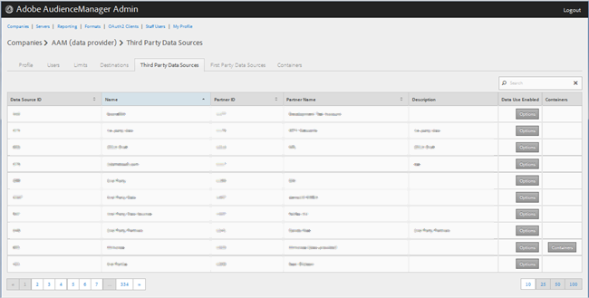

# サードパーティデータプロバイダーの管理 {#manage-third-party-data-providers}

サードパーティデータプロバイダーのコンテナとマッピングを表示または編集します。 また、複数のデータプロバイダーとの共有もできます。

1. **[!UICONTROL Companies]**&#x200B;をクリックし、目的の会社を検索してからクリックして、[!UICONTROL Profile] ページを表示します。

   「[!UICONTROL Search]」ボックス、またはリストの最下部にあるページネーションコントロールを使用して、目的の会社を検索します。 目的の列のヘッダーをクリックすると、その列を昇順または降順に並べ替えることができます。
1. 「**[!UICONTROL Third Party Data Providers]**」タブをクリックします。

   

1. データプロバイダーの行をクリックして、そのデータプロバイダーのコンテナとマッピングを表示または編集します。

   

1. 「**[!UICONTROL Enable Sharing]**」を選択して、次のオプションを有効にします。

   * **Partner Level Overlap：**
   * **Model Use Enabled：**&#x200B;アルゴリズムモデルの作成時にこの会社がこのデータプロバイダーを使用できるようにします。

   共有を有効にすると、このデータプロバイダーから特性にアクセスできるようになります。

1. （オプション）コンテナがこのプロバイダーについて有効になっている場合、使用可能なコンテナのリストから選択済みのコンテナのリストに目的のコンテナを移動すると、このデータプロバイダーに対するコンテナを選択できます。

   このタスクは、[コンテナ](../companies/admin-manage-containers.md#task_61DB5CEECC5049DD8D059C642AC3F967)ページからも実行できます。
1. 変更した場合は&#x200B;**[!UICONTROL Save]**&#x200B;をクリックします。
